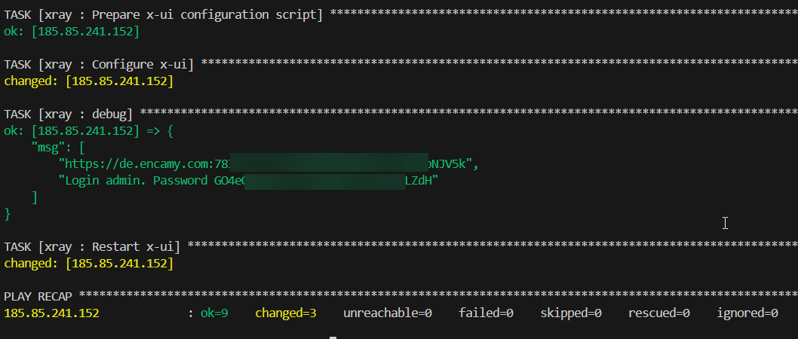

# x-ui install script

This is an opionated installation procedure for x-ui using ansible

This playbook:
- Installs some tools like htop, iperf3, etc...
- Installs and configures certbot for automatic cert renewal
- Installs docker with docker compose plugin
- Installs x-ui from alireza0
- Automatically configures x-ui: script updates panel port, panel url, admin password, initial xray-config with my personal preferences like blocking connection to Russia, etc
- Configures telegram notifications

# Usage

First of all, install ansible and external roles:

```
ansible-galaxy role install geerlingguy.certbot
ansible-galaxy role install geerlingguy.docker
```

Change variables inside of `playbook.yml`. Especially `xui_hostname` and certbot domain and admin email:

| variable | description |
|----------|-------------|
| certbot_admin_email | your email address |
| certbot_certs.email | your email address |
| certbot_certs.domains | your domain |
| xui_hostname | your domain |

Change inventory in `inventory.ini`: fill IP address of your VPS

Set up secrets for telegram:
1. Copy `secrets_file.enc.template` to `secrets_file.enc`
2. Fill you telegram bot token - can be obtained from @botfather
3. Fill you id - can be obtained from @userinfobot
4. Execute `ansible-vault encrypt secrets_file.enc` and set your password

Run playbook:

```
ansible-playbook -i inventory.ini playbook.yaml -e @secrets_file.enc --ask-vault-pass
```

You will be asked for password. Use password for encrypted secrets storage

Panel url and credentials will be shown in the output of the ansible script:



Panel should be fully ready to configure inbounds. Select your desired domain for masking and start using VPN :)

